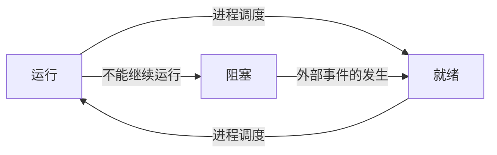

# 进程

> 进程就是一个正在执行程序的实例
>
> 每个进程有一个地址空间和一个控制线程

## 进程的创建

1. 系统初始化
2. 正在运行的程序执行了创建进程的系统调用
3. 用户请求新建一个进程
4. 一个批处理作业的初始化

> unix中，通常使用 ```fork()``` 和 ```execve()``` 或者类似的系统调用来实现新建一个进程

## 进程的终止

1. 正常退出（自愿的）
2. 出错退出（自愿的）
3. 严重错误（非自愿）
4. 被其他进程杀死了（非自愿）

> ```exit()``` ```kill()``` 

## 进程的状态

1. 运行态（实际占用cpu）
2. 就绪态（可运行，因为其他进程正在运行，所以暂时停止）
3. 阻塞态（除非发生某些外部事件，否则不能发生）



## 进程的实现

### 进程表 *process table*

一个进程占用一个进程表项

### 进程表项 *进程控制块 PCB*

包含了进程状态的重要信息

- 进程管理
  - 寄存器
  - 程序计数器
  - etc
- 存储管理
  - 正文段指针
  - 数据段指针
  - 堆栈段指针
- 文件管理
  - 根目录
  - 工作目录
  - 文件描述符
  - 用户id
  - 组id

## 中断发生时

1. 硬件将程序计数器、程序状态字、寄存器等压入堆栈
2. 硬件 从 中断向量 装入 新的 程序计数器，跳转到中断程序
3. 中断程序 保存寄存器，删除堆栈中 刚刚由硬件压入的信息，更换堆栈
4. 中断程序 调用C语言编写的过程
5. 中断程序 完成上一步后 调用调度程序 确定下一步运行的程序
6. 中断程序 准备好寄存器，内存映射之后 启动下一个程序

## 关键字

- 多道程序系统
- 写时复制 *copy-on-write*
- 中断向量